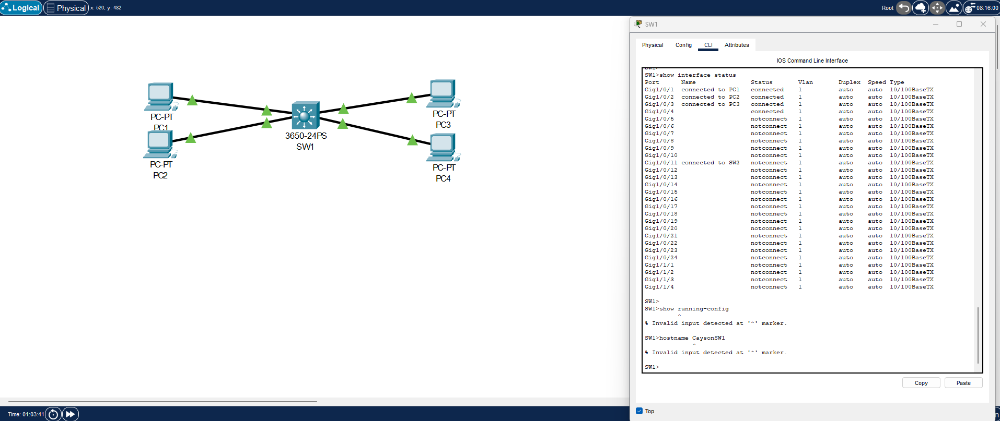
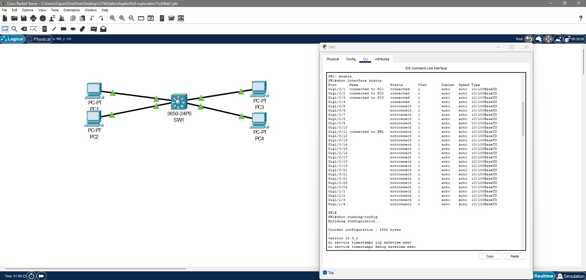
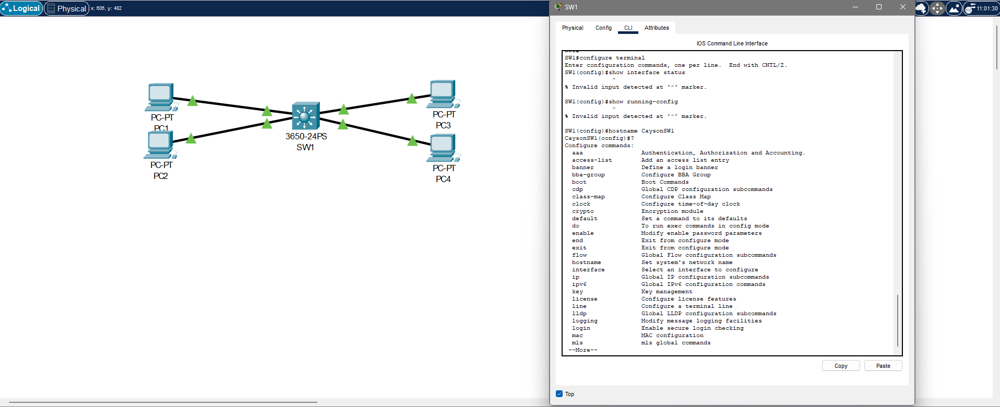

# CCNA Lab 01 – CLI Exploration

## Overview

In this lab, I worked through the Cisco CLI to understand how different modes behave and why certain commands only work in specific places.

## Lab Environment

* Cisco Switch (SW1)
* Packet Tracer
* Simple topology with 4 PCs connected to the switch

## Objective

The goal was to understand the difference between user EXEC mode, privileged EXEC mode, and global configuration mode by actually testing commands in each one.

---

## CLI Mode Testing

### User EXEC Mode (SW1>)

This is the default mode when you first access the device. It has very limited access.

Commands I tested:

* show interfaces status → works
* show running-config → fails
* hostname CaysonSW1 → fails

From this, I learned that this mode is mostly for basic monitoring and does not allow access to configuration or full device information.

---

### Privileged EXEC Mode (SW1#)

I entered this mode using the enable command. This gives full visibility of the device.

Commands I tested:

* show running-config → works
* show interfaces status → works

At this point, I was able to see the full configuration of the device, but I still could not make configuration changes.

---

### Global Configuration Mode (SW1(config)#)

I entered this mode using configure terminal. This is where actual changes are made.

Commands I tested:

* hostname CaysonSW1 → works
* show running-config → fails

This showed me that configuration commands work here, but monitoring commands like show need to be run from privileged mode.

---

## What I Learned

I learned that the CLI is split into different modes, and each mode has a specific purpose. The prompt tells you exactly where you are, and that determines what commands will work.

If you try to run commands in the wrong mode, they will fail, which is actually helpful because it forces you to understand how the CLI is structured.

---

## Challenges

At first, I kept trying commands without paying attention to the prompt, which caused errors. Once I started watching the prompt more closely, it became easier to understand why commands were failing.

---

## Real-World Insight

This is similar to user permissions on a computer. You need higher access to view system details and even higher access to make changes. In a real network, using the wrong mode or command could cause configuration issues.

---

## Summary

This lab helped me understand how to properly move through the Cisco CLI and why command context matters. This is a foundational skill that everything else in networking builds on.
