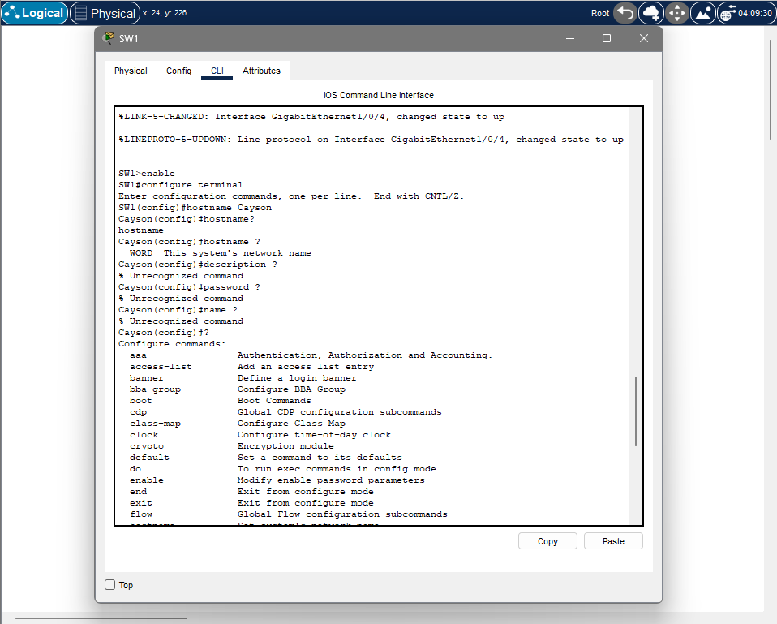
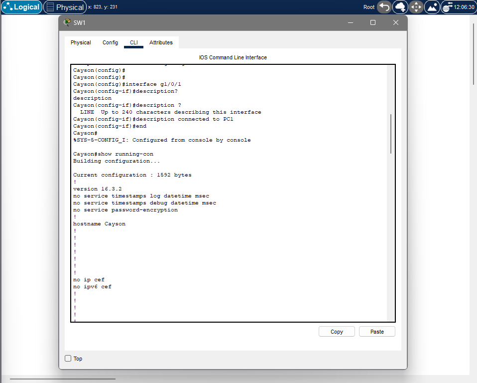
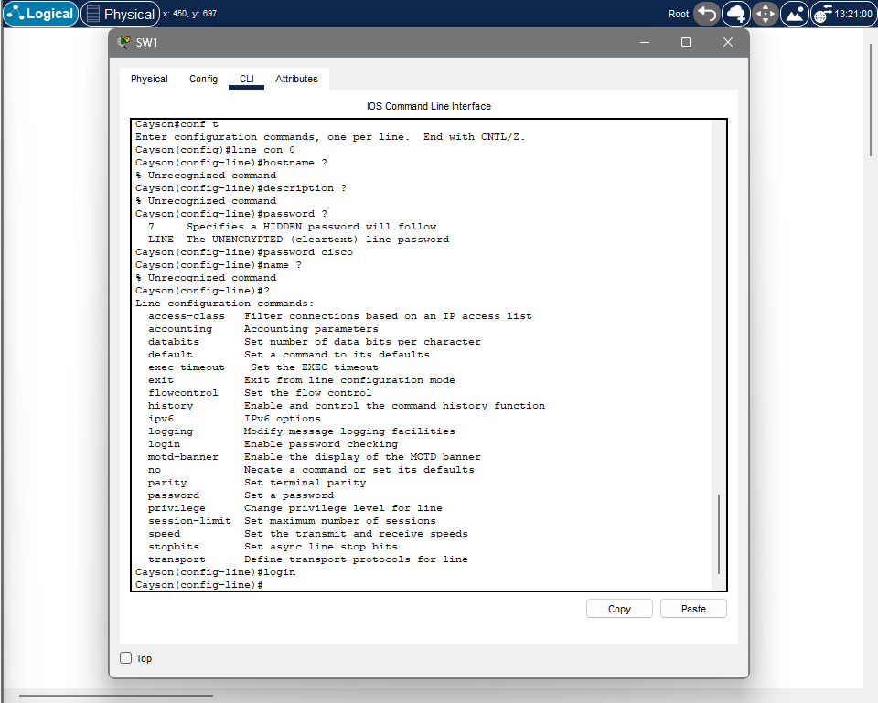
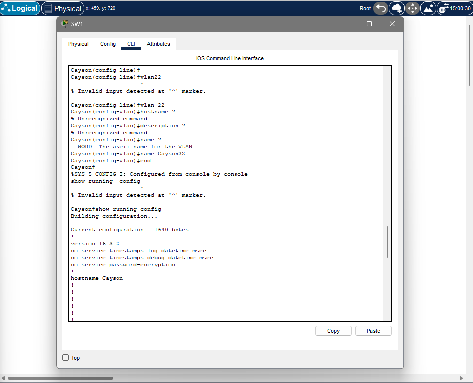

# CCNA Lab 02 – CLI Exploration (Config Lab)

## Overview

In this lab, I continued working with the Cisco CLI, but this time focused on how commands behave inside configuration mode. The goal was to understand how different configuration contexts work and why certain commands only work in specific places.

## Lab Environment

* Cisco Switch (SW1)
* Packet Tracer
* Simple topology with connected devices

## Objective

The goal of this lab was to explore configuration mode in more depth by using the CLI to test commands, switch between contexts, and understand how the `?` command changes depending on where you are.

---

## CLI Exploration in Configuration Mode

### Entering Configuration Mode

I entered privileged mode and then moved into global configuration mode.

Commands used:

* enable
* configure terminal

From here, I was able to start testing how commands behave inside configuration mode.

---

### Using `?` and Testing Commands

I used the `?` command to explore what commands are available in different contexts.

For example:

* `hostname ?` shows that it expects a name
* Some commands returned errors when used in the wrong context

This helped me understand that the CLI is structured, and commands only work in specific modes.

---

### Working in Different Configuration Contexts

I moved into different configuration modes to see how command options change.

Contexts I tested:

* Global config → `(config)#`
* Interface config → `(config-if)#`
* Line config → `(config-line)#`
* VLAN config → `(config-vlan)#`

Example:

* `description` works under interface mode, but not in global config
* `password` works under line configuration

This showed that each context has its own set of commands.

---

### Final Verification and Saving Configuration

After making changes, I verified the configuration and saved it.

Commands used:

* show running-config
* copy running-config startup-config
* show startup-config

This confirmed that:

* My hostname change was applied
* The configuration was saved to startup-config

---

## What I Learned

I learned that configuration mode is not just one level. It is made up of multiple contexts, and each one has its own commands.

The `?` command is very important because it shows what is available based on where you are. If you are in the wrong context, commands will fail.

Understanding the prompt is key, because it tells you exactly what mode you are in and what commands will work.

---

## Challenges

At first, I was trying commands without thinking about the current context, which caused a lot of errors. Once I started paying attention to the prompt and using `?`, it became much easier to understand how the CLI is structured.

---

## Real-World Insight

This is similar to working in different sections of a system. You can’t run every command everywhere. You need to be in the correct context to make the right changes. In real networks, this is important because using commands in the wrong place can lead to configuration issues.

---

## Summary

This lab helped me understand how Cisco CLI configuration mode works beyond just basic commands. I learned how to move between contexts, use built-in help, and verify and save my configuration properly. This builds on the foundation from Lab01 and is important for all future configuration tasks.
