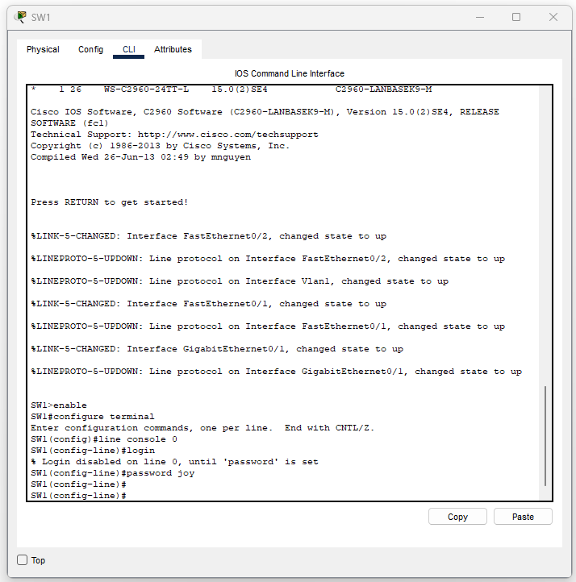
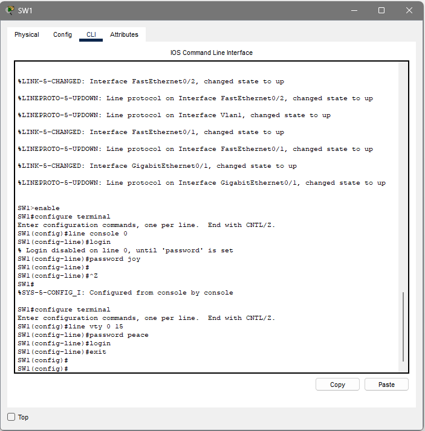
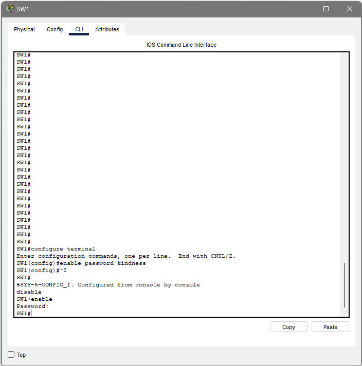
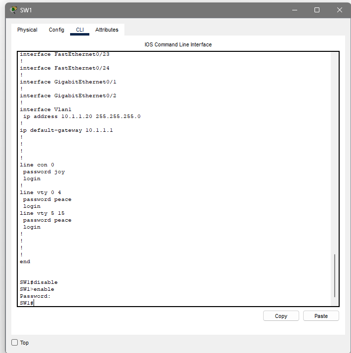

# CCNA Lab 03 – Basic Device Access Configuration

## Overview

In this lab, I configured basic access and security settings on a Cisco switch. This included setting passwords for console and remote access, as well as controlling access to privileged mode.

## Lab Environment

* Cisco Switch (SW1)
* Packet Tracer
* Single switch setup

## Objective

The goal of this lab was to configure basic access security by setting passwords for console access, remote access, and privileged EXEC mode.

---

## Console Line Configuration

I configured the console line to require a password for local access.

Commands used:

* line console 0
* password joy
* login

This ensures that anyone accessing the switch through the console must enter a password.

---

## VTY Line Configuration (Remote Access)

I configured the VTY lines to allow remote login using a password.

Commands used:

* line vty 0 15
* password peace
* login

This allows remote access to the device with authentication.

---

## Enable Password Configuration

I configured an enable password to restrict access to privileged EXEC mode.

Commands used:

* enable password kindness

After exiting and re-entering enable mode, the switch prompted for a password, confirming that the configuration worked.

---

## Verification

I verified the configuration by:

* exiting to user mode
* re-entering privileged mode using the enable command
* confirming that password prompts were required

I also reviewed the running configuration to confirm the settings were applied.

---

## What I Learned

I learned how to secure access to a network device by setting passwords on different access lines. Each line (console and VTY) needs to be configured separately, and the enable password controls access to higher privilege levels.

---

## Challenges

At first, I needed to understand where each password applies. Once I saw the difference between console access, remote access, and privileged mode, it became clearer how the device handles security.

---

## Real-World Insight

These configurations are basic but important. Without passwords, anyone could access and control the device. Setting proper access control is the first step in securing a network.

---

## Summary

This lab focused on setting up basic device security. I configured console access, remote access, and privileged access, and verified that each required authentication.
